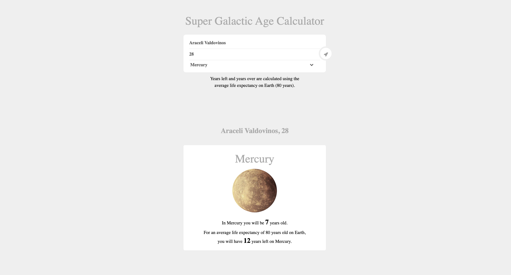

# _Super Galactic Age Calculator_

#### _A web application that determines a user's age based on a planet's solar years_

#### By _Araceli Valdovinos_

## _Technologies Used_

* _JavaScript_
* _jQuery_
* _HTML_
* _CSS_
* _Bootstrap_
* _Jest_
* _webpack_

## Description
_This browser application determines a user's age based on a planet's solar years. It takes a person's age in years and creates a class that does the following:_
* _Returns their age in Mercury years. (A Mercury year is .24 Earth years.)_
* _Returns their age in Venus years. (A Venus year is .62 Earth years.)_
* _Returns their age in Mars years. (A Mars year is 1.88 Earth years.)_
* _Returns their age in Jupiter years. (A Jupiter year is 11.86 Earth years.)_
* _Returns their age in Saturn, Uranus, Neptune and Pluto_
* _Determines how many years a user has left to live on each planet._
* _If a user has already surpassed the average life expectancy, return the number of years they have lived past the life expectancy._

## Setup/Installation Requirements

* _Clone the repository to desktop using "git clone" in terminal_
* _Navigate inside the folder and run "npm install" to download dependencies_
* _Open clone folder in text editor of your choice_
* _Run "npm run start" in terminal to view on browser_
* _Run "npm run test" in terminal to executes test_

## Known Bugs

* _When user double clicks the submit button, information duplicates._

## License
_[MIT](https://opensource.org/licenses/MIT) (c) 2021 Araceli Valdovinos_

## Contact Information
_Araceli Valdovinos araceli.valdovinos@outlook.com_